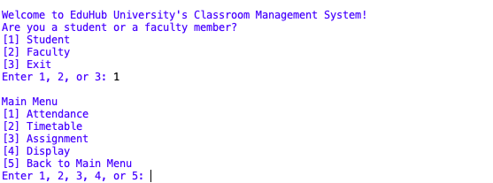

# School Management System (Python)
A simple **Python-based School Management System** designed to manage **assignments, timetables, and attendance records**.  
Developed as part of the *Programming Principles* course.

## Features
### Student Module
- Login as student to view and interact with system data
- View **attendance**, **assignments**, and **timetable**
- Submit assignments and check submission status
- Simple attendance check-in via code verification

### Teacher Module
- Secure login for teachers (password required = "password")
- Create, modify, or delete **courses and timetables**
- Update or view **assignment statuses**
- View all student attendance records

### ⚙️ General System Features
- Console-based user interface (menu navigation)
- Data stored in `.txt` files (no external database required)  
- Easy to modify or extend
- Modular functions for easy maintenance and testing

---

## 🛠️ Technologies Used
- **Language:** Python  
- **Storage:** Text files (`.txt`) — no external database
- **Interface:** Console-based (CLI)  

---

## ▶️ How to Run
1. Clone this repository:
   ```bash
   git clone https://github.com/yourusername/school-management-system.git

2. Navigate into the folder:
  cd school-management-system

3. Ensure the following files are in the same directory:
  - main.py
  - attendance_StudentID.txt
  - assignments_StudentID.txt
  - timetables_StudentID.txt

4. Run the program:
  python main.
  
___


📸 Screenshots
### Student Main Menu


### Attendance Main Menu


### Assingment Main Menu


### Timetable Main Menu


### Faculty Main Menu


